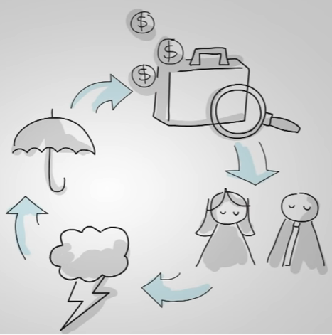
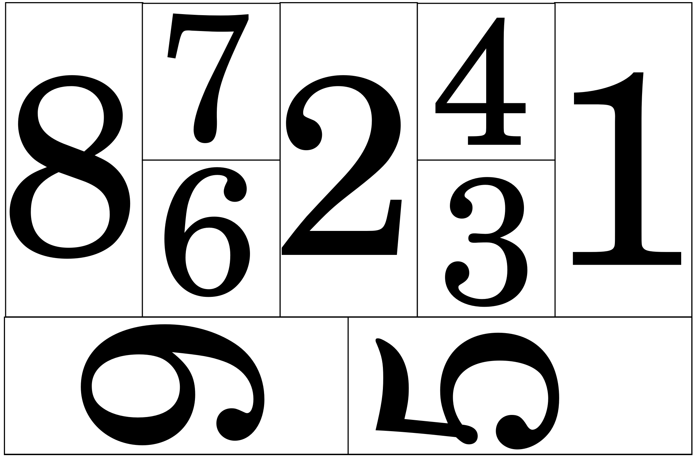

### Explicação do Modelo Business Canvas
Modelo de negócios, irá identificar quem é o seu cliente, qual o problema ele precisa resolver,como seu produto ou serviço pode ajuda lo a resolver e como se ganha dinheiro com isso. 

#### Criadores
<strong>
 
Alexsander  
 
Ivis</strong>
#### O que é o Canvas?
  canvas é um mapa formado por 9 blocos vão converter as descrições das principais
  partes de um negocio.
#### Detalhes:
 
  Atrás deles empreendedores podem colocar
  ideias no papel e empresários inovam, melhora processos, aumentar as vendas, reduzir custos e obter margens melhores
 
#### Como preencher o Canvas ?

<ol>

<li value="1"><strong>O primeiro bloco é do seguimentos de clientes:
strong> Ele trata do diferentes grupos de pessoas ou empresa que se pretender atender.
<ul><li>Para quem estou criando valor?</li><li>Quem são meus clientes mais importantes?</li></ul></li>

	<li>
	<strong>O segundo bloco traz a proposta de valor:</strong> são produtos e serviços que geram benefícios para o seguimento de clientes, ele descreve como a empresa se diferencia dos concorrentes.
		<ul>
			<li>Quem são meus clientes mais importantes?</li>
			<li>Qual valor eu entrego ao meu cliente?</li>
			<li>Quais problemas dos meus cliente eu ajudo a resolver?</li>
		</ul>
	</li>

<li>
<strong>O terceiro são de canais da empresa que pode ser comunicação, comunicação vendas e distribuição:</strong> Por meio dele o cliente pode conhecer melhor a sua proposta de valor, efetuar a compra e receber assistencia.<ul><li>Por quais canias nossos cliente querem ser abordados?</li><li>Qual é o custo beneficio de cada canal?</li><li>Como os clientes ficam sabendo da minha oferta?</li></ul></li>

<li><strong>O quarto estabelece o tipo de relacionamento que a empresa tem sobre seus clientes e como fortalecer esse relacionamento:</strong><ul><li>Que tipo de relacionamento meus clientes esperam?</li><li>Como criar vinculos duradouros com meus clientes?</li></ul></li>

<li><strong>O quinto é o bloco fontes de receita:</strong> Que representa o quanto e como o cliente pagara pelos benefícios recebidos a partir da proposta de valor.<ul><li>Qual valor meus cliente estão dispostos a pagar?</li><li>Como eles preferem pagar?</li></ul></li>

<li><strong>O sexto são os recursos principais da empresa:</strong> Irá estabelecer os recursos chaves para a operação da empresa.<ul><li>Quais recursos criticos são esenciais para minha proposta de valor?</li></ul></li>

<li><strong>O setimo identificar as atividades chaves:</strong> Que a empresa deve execultar para que seu modelo de negocio funcione.<ul><li>Que atividades são importantes para minha proposta de valor?</li></ul></li>

<li><strong>O oitavo são as parcerias principais:</strong> Ou seja a rede de parceiros necessarios para que a empresa funcione e entregue sua oferta de valor.<ul><li>Quem são nossos parceiros estrategicos e os pricipais fornecedores?</li></ul></li>

<li><strong>O nono é a escolha da estrutura de custos:</strong> Ela representa para constuir e manter a oferta de valor da empresa.<ul><li>Quais são os custos mais importantes?</li><li>Quais os recursos e atividades mais caros?</li></ul></li>

</ol>
### Dicas para desenhar seu modelo de negócios:
<ol>
	<li value="1">Faça um trabalho colaborativo envolvendo colaboradores e se possível clientes.</li>
	<li>Imprima ou desenhe o quadro em uma folha grande. </li>
	<li>Use posetis e marcadores começando pelo lado direito identificando valor que sua empre vai gerar. </li>
	<li>Definir o tripe cliente, proposta de valor, fonte de receita. </li>
	<li>Escolha um seguimento de clientes. </li>
	<li>Deixe clara sua proposta de valor e pense como gerar receita em cima dessa proposta. </li>
	<li>Defina os canais e a estrategia de relacionamento com o cliente. </li>
	<li>Após finalizados os passos anteriores var para o lado esquerdo representado pelos atividades chaves, parcerias princiapis, recursos principais e estrutura de custo. </li>
	<li>Use deseno e tecnicas de ideação para gerarem sites e inovações para o seu negocio. </li>
	<li>Avalie criticamente o modelo para torna lo viável.</li>
	<li>Faço protótipos, esperimente, e valide seu modelo na pratica.</li>
	<li>Teste serviços, produtos com o seu cliente e colha seus feedbak, antes de fazer grandes investimentos.</li> 
</ol>

